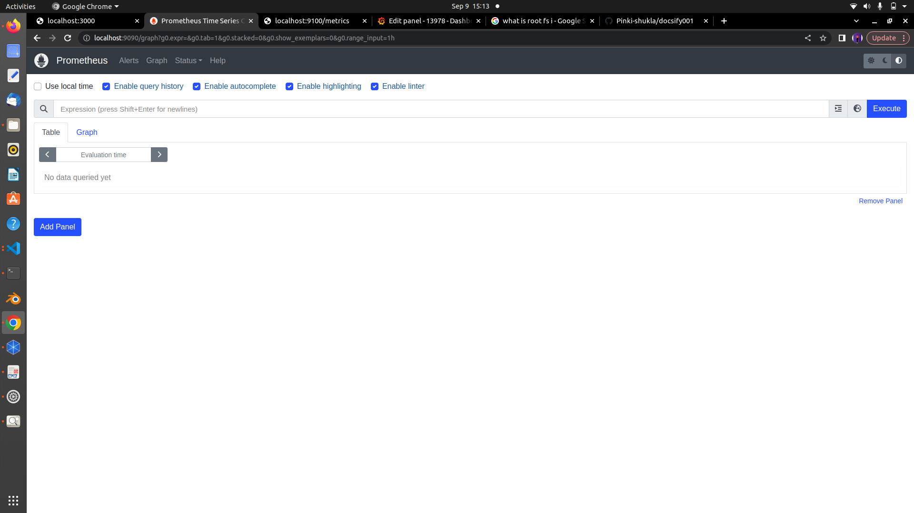

<center> <u> <h1 style="font-size: 50px;">Grafana Setup Documentation</center></h1> </u> </center><br>

## Task requirement:
"Setting Up Monitoring Infrastructure with Grafana, Prometheus, and Node Exporter".<br>
## Monitoring :

Regular collection of information and data to measure progress of projects and activities so we can track performance and resources utilization over time.
## System Configuration:

* OS Name : Ubuntu 22.04.6 LTS
* Podman version:- 3.4.2
* RAM : 5.6 GiB
* CPU : 2
* STORAGE : 512 GB
  

## Prerequisite tools:
  
- Podman version 3.4.4 (This is optional otherwise,you can apply on base as well. )
- Grafana
- Prometheus
- Node-exporter
# Definition of tools
## Podman: 
Podman is an open source tool for developing, managing, and running containers
on your Linux® system
## Grafana :

Grafana open-source software enables you to query, visualize, alert on, and explore your metrics, logs, and traces wherever they are stored.

* Query
* Visualise
* Alert
## Prometheus :

Prometheus is an open source monitoring solution written in Go that collects metrics data and stores that data in a time series database. <br>
Grafana allows to visualize the data stored in prometheus.<br>
## Node-exporter:<br>
Node Exporter is a software tool that collects system-level metrics from servers and nodes, exposing them in a format that can be scraped by Prometheus for monitoring and analysis.<br>
Node Exporter collects a wide range of system metrics, including CPU Usage, Memory Usage, Disk Usage, System load.<br>

# Installation Process:

## Step-1 Install podman:

- Firstly, update your system.

#### Command:-
```
sudo apt update
```
#### Output:-
```
pinki@keenable:~$ sudo apt update
[sudo] password for pinki: 
Hit:1 http://in.archive.ubuntu.com/ubuntu jammy InRelease                      
Hit:2 http://in.archive.ubuntu.com/ubuntu jammy-updates InRelease              
Hit:3 http://security.ubuntu.com/ubuntu jammy-security InRelease    
Hit:4 http://in.archive.ubuntu.com/ubuntu jammy-backports InRelease
Hit:5 https://ppa.launchpadcontent.net/ondrej/php/ubuntu jammy InRelease
Reading package lists... Done
Building dependency tree... Done
Reading state information... Done
2 packages can be upgraded. Run 'apt list --upgradable' to see them.


```
- Now, upgrade your system.


#### command:-
```

sudo apt upgrade -y

```
#### Output:-
```
pinki@keenable:~$ sudo apt upgrade -y
Reading package lists... Done
Building dependency tree... Done
Reading state information... Done
Calculating upgrade... Done
Get more security updates through Ubuntu Pro with 'esm-apps' enabled:
  gsasl-common libgsasl7
Learn more about Ubuntu Pro at https://ubuntu.com/pro
The following packages have been kept back:
  gjs libgjs0g
0 upgraded, 0 newly installed, 0 to remove and 2 not upgraded.

```
- Install podman by using this command.

#### Command:-
```
sudo apt install -y podman
```
#### Output:-

```
keen@keenable:~$ sudo apt install -y podman
sudo: unable to resolve host keenable.com: Temporary failure in name resolution
Reading package lists... Done
Building dependency tree... Done
Reading state information... Done
The following additional packages will be installed:
  buildah catatonit conmon containernetworking-plugins crun fuse-overlayfs
  golang-github-containernetworking-plugin-dnsname
  golang-github-containers-common golang-github-containers-image libostree-1-1
  libslirp0 slirp4netns uidmap
Suggested packages:
  containers-storage docker-compose
The following NEW packages will be installed:
  buildah catatonit conmon containernetworking-plugins crun fuse-overlayfs
  golang-github-containernetworking-plugin-dnsname
  golang-github-containers-common golang-github-containers-image libostree-1-1
  libslirp0 podman slirp4netns uidmap
0 upgraded, 14 newly installed, 0 to remove and 11 not upgraded.
Need to get 25.4 MB of archives.
After this operation, 110 MB of additional disk space will be used.
Get:1 http://in.archive.ubuntu.com/ubuntu jammy-updates/universe amd64 uidmap amd64 1:4.8.1-2ubuntu2.1 [22.4 kB]
Get:2 http://in.archive.ubuntu.com/ubuntu jammy/universe amd64 golang-github-containers-image all 5.16.0-3 [29.3 kB]
Get:3 http://in.archive.ubuntu.com/ubuntu jammy/universe amd64 golang-github-containers-common all 0.44.4+ds1-1 [28.1 kB]
Get:4 http://in.archive.ubuntu.com/ubuntu jammy/universe amd64 libostree-1-1 amd64 2022.2-3 [333 kB]
Get:5 http://in.archive.ubuntu.com/ubuntu jammy/universe amd64 buildah amd64 1.23.1+ds1-2 [6,094 kB]
Get:6 http://in.archive.ubuntu.com/ubuntu jammy/universe amd64 catatonit amd64 0.1.7-1 [307 kB]
Get:7 http://in.archive.ubuntu.com/ubuntu jammy/universe amd64 conmon amd64 2.0.25+ds1-1.1 [35.1 kB]
Get:8 http://in.archive.ubuntu.com/ubuntu jammy/universe amd64 containernetworking-plugins amd64 0.9.1+ds1-1 [6,422 kB]
Get:9 http://in.archive.ubuntu.com/ubuntu jammy/universe amd64 crun amd64 0.17+dfsg-1.1 [300 kB]
Get:10 http://in.archive.ubuntu.com/ubuntu jammy/universe amd64 fuse-overlayfs amd64 1.7.1-1 [44.7 kB]
Get:11 http://in.archive.ubuntu.com/ubuntu jammy/universe amd64 golang-github-containernetworking-plugin-dnsname amd64 1.3.1+ds1-2 [1,083 kB]
Get:12 http://in.archive.ubuntu.com/ubuntu jammy/main amd64 libslirp0 amd64 4.6.1-1build1 [61.5 kB]
Get:13 http://in.archive.ubuntu.com/ubuntu jammy-updates/universe amd64 podman amd64 3.4.4+ds1-1ubuntu1.22.04.2 [10.6 MB]
Get:14 http://in.archive.ubuntu.com/ubuntu jammy/universe amd64 slirp4netns amd64 1.0.1-2 [28.2 kB]
Fetched 25.4 MB in 11s (2,307 kB/s)                                            
Selecting previously unselected package uidmap.
(Reading database ... 203444 files and directories currently installed.)
Preparing to unpack .../00-uidmap_1%3a4.8.1-2ubuntu2.1_amd64.deb ...
Unpacking uidmap (1:4.8.1-2ubuntu2.1) ...
Selecting previously unselected package golang-github-containers-image.
Preparing to unpack .../01-golang-github-containers-image_5.16.0-3_all.deb ...
Unpacking golang-github-containers-image (5.16.0-3) ...
Selecting previously unselected package golang-github-containers-common.
Preparing to unpack .../02-golang-github-containers-common_0.44.4+ds1-1_all.deb 
...
Unpacking golang-github-containers-common (0.44.4+ds1-1) ...
Selecting previously unselected package libostree-1-1:amd64.
Preparing to unpack .../03-libostree-1-1_2022.2-3_amd64.deb ...
Unpacking libostree-1-1:amd64 (2022.2-3) ...
Selecting previously unselected package buildah.
Preparing to unpack .../04-buildah_1.23.1+ds1-2_amd64.deb ...
Unpacking buildah (1.23.1+ds1-2) ...
Selecting previously unselected package catatonit.
Preparing to unpack .../05-catatonit_0.1.7-1_amd64.deb ...
Unpacking catatonit (0.1.7-1) ...
Selecting previously unselected package conmon.
Preparing to unpack .../06-conmon_2.0.25+ds1-1.1_amd64.deb ...
Unpacking conmon (2.0.25+ds1-1.1) ...
Selecting previously unselected package containernetworking-plugins.
Preparing to unpack .../07-containernetworking-plugins_0.9.1+ds1-1_amd64.deb ...
Unpacking containernetworking-plugins (0.9.1+ds1-1) ...
Selecting previously unselected package crun.
Preparing to unpack .../08-crun_0.17+dfsg-1.1_amd64.deb ...
Unpacking crun (0.17+dfsg-1.1) ...
Selecting previously unselected package fuse-overlayfs.
Preparing to unpack .../09-fuse-overlayfs_1.7.1-1_amd64.deb ...
Unpacking fuse-overlayfs (1.7.1-1) ...
Selecting previously unselected package golang-github-containernetworking-plugin
-dnsname.
Preparing to unpack .../10-golang-github-containernetworking-plugin-dnsname_1.3.
1+ds1-2_amd64.deb ...
Unpacking golang-github-containernetworking-plugin-dnsname (1.3.1+ds1-2) ...
Selecting previously unselected package libslirp0:amd64.
Preparing to unpack .../11-libslirp0_4.6.1-1build1_amd64.deb ...
Unpacking libslirp0:amd64 (4.6.1-1build1) ...
Selecting previously unselected package podman.
Preparing to unpack .../12-podman_3.4.4+ds1-1ubuntu1.22.04.2_amd64.deb ...
Unpacking podman (3.4.4+ds1-1ubuntu1.22.04.2) ...
Selecting previously unselected package slirp4netns.
Preparing to unpack .../13-slirp4netns_1.0.1-2_amd64.deb ...
Unpacking slirp4netns (1.0.1-2) ...
Setting up crun (0.17+dfsg-1.1) ...
Setting up uidmap (1:4.8.1-2ubuntu2.1) ...
Setting up libostree-1-1:amd64 (2022.2-3) ...
Setting up golang-github-containers-image (5.16.0-3) ...
Setting up conmon (2.0.25+ds1-1.1) ...
Setting up containernetworking-plugins (0.9.1+ds1-1) ...
Setting up catatonit (0.1.7-1) ...
Setting up golang-github-containernetworking-plugin-dnsname (1.3.1+ds1-2) ...
Setting up libslirp0:amd64 (4.6.1-1build1) ...
Setting up fuse-overlayfs (1.7.1-1) ...
Setting up golang-github-containers-common (0.44.4+ds1-1) ...
Setting up buildah (1.23.1+ds1-2) ...
Setting up slirp4netns (1.0.1-2) ...
Setting up podman (3.4.4+ds1-1ubuntu1.22.04.2) ...
Created symlink /etc/systemd/user/default.target.wants/podman.service \u2192 /usr/lib
/systemd/user/podman.service.
Created symlink /etc/systemd/user/sockets.target.wants/podman.socket \u2192 /usr/lib/
systemd/user/podman.socket.
Created symlink /etc/systemd/system/default.target.wants/podman.service \u2192 /lib/s
ystemd/system/podman.service.
Created symlink /etc/systemd/system/sockets.target.wants/podman.socket \u2192 /lib/sy
stemd/system/podman.socket.

Created symlink /etc/systemd/system/default.target.wants/podman-auto-update.service \u2192 /lib/systemd/system/podman-auto-update.service.###########################################################.....
Created symlink /etc/systemd/system/timers.target.wants/podman-auto-update.timer \u2192 /lib/systemd/system/podman-auto-update.timer.
Created symlink /etc/systemd/system/default.target.wants/podman-restart.service \u2192 /lib/systemd/system/podman-restart.service.
Processing triggers for libc-bin (2.35-0ubuntu3.4) ...
Processing triggers for man-db (2.10.2-1) ...


```

- Check version of Podman.
#### command:-
```
podman version
```
#### Output:-
```
keen@keenable:~$ podman version
Version:      3.4.4
API Version:  3.4.4
Go Version:   go1.18.1
Built:        Thu Jan  1 05:30:00 1970
OS/Arch:      linux/amd64

```
- After the installation is complete, you can check the version of Podman installed on your system by running this command. It will display the version number of Podman.

## Step-2 Create a Grafana container:
To run the latest stable version of Grafana, run the following command:
#### Command:-
```
podman run -d -p 3001:3000 --name=grafana docker.io/grafana/grafana-enterprise

```
#### Output:-
```
pinki@keenable:~$ podman run -d -p 3001:3000 --name=grafana docker.io/grafana/grafana-enterprise
Trying to pull docker.io/grafana/grafana-enterprise:latest...
Getting image source signatures
Copying blob e398c536bbf8 done  
Copying blob 96526aa774ef done  
Copying blob 9851ec084fb8 done  
Copying blob 2b52ce432cc7 done  
Copying blob f52c6841ba6a done  
Copying blob 87adc2d215c6 done  
Copying blob 8c1b0ec3fd24 done  
Copying blob c656f66855f6 done  
Copying blob f677985c17bf done  
Copying blob 04d9aeafd2e8 done  
Copying config a121188397 done  
Writing manifest to image destination
Storing signatures
50d71cfb3a8d3e83c0b3d2be1a6b580f1ebf4b0003a159250858931579dd20ab
pinki@keenable:~$ 


```


Where:

<b>  run</b> = run directly from the command line
<b>d </b>= run in the background
<b>p </b>= assign the port number, which in this case is 3001
<b>name</b> = assign a  name to the container, for example, grafana

<v> docker.io/grafana/grafana-enterprise: </b> This is the name of the image we want to run inside the container. It's called 'grafana-enterprise,' and it's stored in a special place on the internet called 'Docker Hub.'

http://localhost:3001 hit on the web browser to see the Grafana login page in your web browser.


## Use these options to create dashboards and alerts.


## Step-3 Create Prometheus container on Podman:

- <b>Create directory :-</b>

#### Command:-
```
mkdir prometheus
```

The mkdir command in Linux is used to create a new directory (folder).
mkdir prometheus, you are instructing the system to create a new directory with the name "prometheus."
- <b>Create file:-</b>

Create a file name "prometheus.yml"  into the prometheus directory which you have created above.
Go inside the "prometheus" directory by using cd command.

The cd command in Linux is used to change the current working directory. When you execute cd prometheus, you are instructing the system to change the current working directory to the directory named "prometheus."
#### Command:-
```
cd prometheus
```
Now create "prometheus.yml' file into the prometheus directory.


To create and edit a file using Vim command.
#### Command:-
```
 vim prometheus.yml
```

 ```
pinki@keenable:~$ mkdir prometheus
pinki@keenable:~$ cd prometheus
pinki@keenable:~/prometheus$ ls
pinki@keenable:~/prometheus$  vim prometheus.yml

 ```
  #### prometheus.yml is a configuration file of prometheus.

(push all the data in your prometheus.yml file which has been given below)
```
global:
  scrape_interval: 5s
  external_labels:
    monitor: 'node'

scrape_configs:
  - job_name: 'prometheus'
    static_configs:
      - targets: ['192.168.122.163:9090']

  - job_name: 'node-exporter'
    static_configs:
      - targets: ['192.168.122.163:9100']

```


```
global:
  scrape_interval: 5s
  external_labels:
    monitor: 'node'

scrape_configs:
  - job_name: 'prometheus'
    static_configs:
      - targets: ['192.168.122.163:9090']

  - job_name: 'node-exporter'
    static_configs:
      - targets: ['192.168.122.163:9100']

~                                                                                                                                                                                                            
~                                                                                                                                                                                                            
~                                                                                                                                                                                                            
~                                                                                                                                                                                                            
~                                                                                                                                                                                                            
~                                                                                                                                                                                                            
~                                                                                                                                                                                                            
~                                                                                                                                                                                                            
~                                                                                                                                                                                                            
~                                                                                                                                                                                                            
~                                                                                                                                                                                                            
~                                                                                                                                                                                                            
~                                                                                                                                                                                                            
~                                                                                                                                                                                                            
~                                                                                                                                                                                                            
~                                                                                                                                                                                                            
~                                                                                                                                                                                                            
~                                                                                                                                                                                                            
~                                                                                                                                                                                                            
~                                                                                                                                                                                                            
~                                                                                                                                                                                                            
~                                                                                                                                                                                                            
~                                                                                                                                                                                                            
~                                                                                                                                                                                                            
~                                                                                                                                                                                                            
~                                                                                                                                                                                                            
~                                                                                                                                                                                                            
~                                                                                                                                                                                                            
~                                                                                                                                                                                                            
~                                                                                                                                                                                                            
~                                                                                                                                                                                                            
~                                                                                                                                                                                                            
~                                                                                                                                                                                                            
~                                                                                                                                                                                                            
~                                                                                                                                                                                                            
~                                                                                                                                                                                                            
~                                                                                                                                                                                                            
~                                                                                                                                                                                                            
:wq!


```


- job_name: 'prometheus'
	static_configs:
  	- targets: ['192.168.122.163:9090']<br>
  (In target you have to assign your IP address also provide the port of prometheus which you will assign while creating prometheus container)

- job_name: 'node-exporter'
	static_configs:
  	- targets: ['192.168.122.163:9100']<br>
  (In target you have to assign your IP address also provide the port of node-exporter which you will assign while creating node-exporter container)

#### Command:-
```
  podman run -d --name prometheus -p 9090:9090 -v /home/pinki/prometheus/prometheus.yml:/etc/prometheus/prometheus.yml docker.io/prom/prometheus
 ```

#### Output:-
```
pinki@keenable:~/prometheus$ podman run -d --name prometheus -p 9090:9090 -v /home/pinki/prometheus/prometheus.yml:/etc/prometheus/prometheus.yml docker.io/prom/prometheus
Trying to pull docker.io/prom/prometheus:latest...
Getting image source signatures
Copying blob 1979e9ba2ee4 done  
Copying blob 2abcce694348 done  
Copying blob 7cba3896d5e3 done  
Copying blob c2417c8f4f7c done  
Copying blob f256c16a5607 done  
Copying blob 0e36311405c5 done  
Copying blob 0491ad62256e done  
Copying blob 0da5791e6e74 done  
Copying blob deacc6707a51 done  
Copying blob 62c7872eeedd done  
Copying blob 6a5286f5f0ae done  
Copying blob aaf7e836db0f done  
Copying config 620d5e2a39 done  
Writing manifest to image destination
Storing signatures
c7bc4257834762388111ec4f2acdd2944d6a165405efbedad76416bd41d048c7
pinki@keenable:~/prometheus$ 


```
 

#### Command Description:-
<b>podman run:</b> This part of the command instructs podman to run a container.

<b>d:</b> This flag stands for "detached" mode. It runs the container in the background

<b>--name prometheus:</b> This flag assigns a name to the container. In this case, the container is named "prometheus."

<b>-p 9090:9090:</b> This flag specifies port mapping. It tells podman to map port 9090 on the host to port 9090 inside the container. 

<b>-v /home/pinki/prometheus/prometheus.yml:/etc/prometheus/prometheus.yml:</b> This flag specifies a volume mount. It connects a directory or file on your host system to a location inside the container.

In this case, it's mounting the file /home/pinki/prometheus/prometheus.yml from your host into the container at /etc/prometheus/prometheus.yml 

* <b>" /home/pinki/prometheus/prometheus.yml":</b> This is the path to the Prometheus configuration file on your host. It's being shared with the container.  

*  <b>"/etc/prometheus/prometheus.yml": </b>This is where Prometheus expects its configuration file to be inside the container.

<b> docker.io/prom/prometheus: </b>This is the name of the Docker image you want to run as a container. It specifies the image's repository and name. In this case, you are running the "prometheus" image from the "prom" repository on Docker Hub

http://localhost:9090 on the web browser to see the prometheus.


  


  

 ## Step-4 Create Node exporter container on podman

#### Command:-
```

podman run -d --name=node-exporter -p 9100:9100 -v"/:/host:ro,rslave" quay.io/prometheus/node-exporter:latest --path.rootfs=/host

 ```
#### Output:-

 ```
 pinki@keenable:~$ podman run -d --name=node-exporter -p 9100:9100 -v"/:/host:ro,rslave" quay.io/prometheus/node-exporter:latest --path.rootfs=/host
Trying to pull quay.io/prometheus/node-exporter:latest...
Getting image source signatures
Copying blob 2abcce694348 skipped: already exists  
Copying blob 455fd88e5221 done  
Copying blob 324153f2810a done  
Copying config 72c9c20889 done  
Writing manifest to image destination
Storing signatures
b7cbaf2e5b4eeb25dd2f166f1afa9c085185b834e7ad18c15acd00a8c2532ddf
pinki@keenable:~$ 

 ```


#### Command Description:-

 <b>podman run:</b> This part of the command instructs podman to run a container.

 <b>-d:</b> This flag stands for "detached" mode.</b>

 <b>--name=node-exporter:</b> This flag assigns a name to the container. In this case, the container is named "node-exporter." 

 <b>-p 9100:9100: </b>This flag specifies port mapping. it allows you to access the service inside the container via port 9100 on your host.

 <b>"/:/host:ro,rslave": </b> This part specifies the volume configuration. It tells podman to mount the root directory of your host (represented by <b>"/"</b>) to the <b>"/host"</b> directory inside the container. The<b> "ro"</b> option stands for "read-only," which means the container can read the files on the host but can't modify them. The rslave option is related to mount propagation, allowing mounted file systems to be shared among containers.

<b>quay.io/prometheus/node-exporter:latest:</b> In this case, you are running the "node-exporter" image from the "prometheus" repository on Quay.io. The ":latest" tag indicates that you want to use the latest version of this image.

<b>--path.rootfs=/host:</b> This is an additional command passed to the container. It specifies the root file system path as "/host" inside the container. This can be important for some containerized applications to correctly access system resources.

 http://localhost:9100 on the web browser to see Node-expoerter.

 
 ## Now you can see our all containers are ready grafana,prometheus and node-exporter

#### Command:-

  ```
 podman ps
  ```
The <b>podman ps</b> command is used to list the currently running containers on your system. It provides information about the containers that are actively running and includes details such as the container ID, names, status, and other relevant information.
#### Output:-

```
pinki@keenable:~$ podman ps
CONTAINER ID  IMAGE                                        COMMAND               CREATED         STATUS             PORTS                   NAMES
50d71cfb3a8d  docker.io/grafana/grafana-enterprise:latest                        46 minutes ago  Up 46 minutes ago  0.0.0.0:3001->3000/tcp  grafana
c7bc42578347  docker.io/prom/prometheus:latest             --config.file=/et...  26 minutes ago  Up 12 minutes ago  0.0.0.0:9090->9090/tcp  prometheus
b7cbaf2e5b4e  quay.io/prometheus/node-exporter:latest      --path.rootfs=/ho...  2 minutes ago   Up 2 minutes ago   0.0.0.0:9100->9100/tcp  node-exporter
pinki@keenable:~$ 

```

 
## Grafana setup has been ready with Dashboard. 


    

    


    


